[Cloudbet](https://www.cloudbet.com/) API is publicly available, with documentation available at the [Cloudbet API Docs website](https://docs.cloudbet.com/) and provides you with Feed, Trading and Account APIs. This allows you to both access Cloudbet feeds and bet on odds offered by Cloudbet.

## Cloudbet API Docs

These are the Cloudbet API Docs available currently:

* [Cloudbet Feed API Docs](https://docs.cloudbet.com/?urls.primaryName=Feed)
* [Cloudbet Trading API Docs](https://docs.cloudbet.com/?urls.primaryName=Trading)
* [Cloudbet Account API Docs](https://docs.cloudbet.com/?urls.primaryName=Account)

## Cloudbet API Protobuf Schemas

The Cloudbet API consists of Feed, Trading and Account API. The Feed API provides market odds, the Trading API allows you to bet on these markets and the Account API allows you to query your account details such as currencies and balances.

This repository contains protocol buffer v3 (protobuf) definitions and generated `Go` protobuf files which can be used as reference when integrating the Cloudbet API.

Note that our API uses the `Go` [`protojson`](https://pkg.go.dev/google.golang.org/protobuf/encoding/protojson) library for marshaling and unmarshaling of protobuf messages as JSON format in API requests and responses.

### Organization

There are two sub-directories called `cloudbet` and `go/cloudbet`. These sub-directories have Feed, Trading and Account API protobuf and generated Go files. The `response` protobuf is used by all the API endpoints to render responses, including response status and error responses.

1. `cloudbet` contains the protobuf files for `account`, `feed`, `trading` and `response` API.
2. `go/cloudbet` contains the go protobuf files generated from the protobuf files above.

## Cloudbet API Samples

In addition, you can obtain code and response samples for the Cloudbet API within this repository:

* [Code Samples](https://github.com/Cloudbet/docs/blob/master/api-sample.js)
* [Response Samples](https://github.com/Cloudbet/docs/blob/master/api-responses.md)

## Markets, Sports and Categories List

For a full list of markets, sports and categories, please see this [Github gist](https://gist.github.com/kgravenreuth/6703e1e213aecac4d5728f2f699d34e7)

## Event Status

Events on Cloudbet can have different status depending on whether the event has markets offered, is live, has ended etc. This status is reflected in the `Event.status` field in our Feed API. Here is a summary of the different event statuses and their details.

## Issues/Questions

Start a new discussion in the [Cloudbet API discussions community](https://github.com/Cloudbet/docs/discussions) about any questions you may have. Someone from the community or from Cloudbet will help you out soon.
